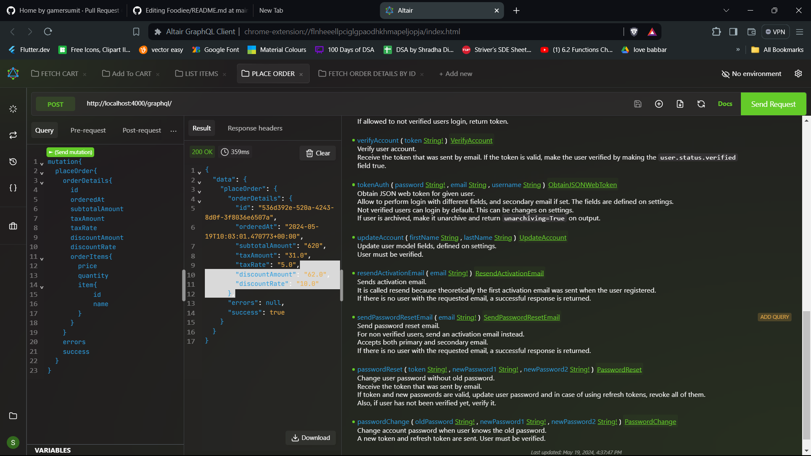
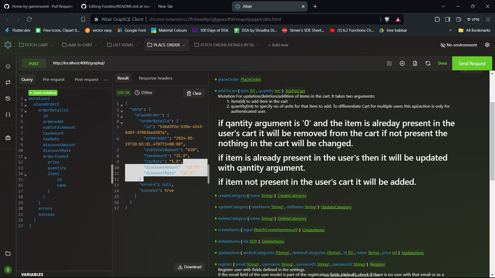

<h1>Shop Site Project</h1>

<h3>Overview</h3>

This project is an online shop site built using Django and GraphQL APIs. It offers functionalities for user authentication, item and category management, shopping cart operations, and order processing. The admin has control over the menu items, while users can interact with the cart and place orders.

<h4>Note:</h4>

This project provides only the backend functionalities. A separate frontend application would be needed to interact with this backend.

<h3>ScreenShots</h3>
<table>
  <tr>
    <td>
      
    </td>
    <td style="padding-left: 20px;">
      
    </td>
    <td style="padding-left: 20px;">
      
    </td>
    <td style="padding-left: 20px;">
      
    </td>
  </tr>
</table>
<h3>Features</h3>
<ol>
    <li>
        <h4>User Authentication:</h4>
        <ul>
            <li><h5>User login and registration</h5></li>
            <li><h5>JWT Token Authentication</h5></li>
            <li><h5>Email verification</h5></li>
        </ul>
    </li>
    <li>
        <h4>Menu Management:</h4>
        <ul>
            <li><h5>Category and Item models</h5></li>
            <li><h5>Only admins can create, update, and delete (CUD) categories and items</h5></li>
        </ul>
    </li>
    <li>
        <h4>Shopping Cart:</h4>
        <ul>
            <li><h5>Fetch cart items</h5></li>
            <li><h5>Add items to cart</h5></li>
            <li><h5>Unique cart for each user</h5></li>
        </ul>
    </li>
    <li>
        <h4>Order Management:</h4>
        <ul>
            <li><h5>Place orders using the cart</h5></li>
            <li><h5>Cart is emptied after placing an order</h5></li>
            <li><h5>GraphQL mutation for placing an order (PlaceOrder)</h5></li>
            <li><h5>Query single and multiple orders</h5></li>
        </ul>
    </li>
    <li>
        <h4>Batch Create Items:</h4>
        <ul>
            <li><h5>Batch creation of items</h5></li>
            <li><h5>Items can belong to multiple categories</h5></li>
        </ul>
    </li>
</ol>

  

<h3>Technologies Used</h3>
<ul>
    <li>
        <h5>
   Django
        </h5>
    </li>
    <li>
        <h5>
             GraphQL APIs
        </h5>
    </li>
    <li>
        <h5>
             Python
        </h5>
    </li>
    <li>
        <h5>
             Postgres SQL
        </h5>
    </li>
    <li>
        <h5>DjangoObjectType (Graphene-Django)</h5></li>
    <li>
        <h5>SQL</h5></li>
</ul>

  

<h3>Installation (MAC/LINUX/WINDOWS):</h3>
<ol>
    <li>
        <h5>Clone the repository:</h5>
        <ul>
            <li><h6>git clone &lt;repository_url&gt;</h6></li>
            <li><h6>cd shop-site</h6></li>
        </ul>
    </li>
    <li>
        <h5>Create and activate a virtual environment:</h5>
        <ul>
            <li><h6>MAC: python3 -m venv env</h6></li>
            <li><h6>LINUX/WIN: python -m venv env</h6></li>
            <li><h6>MAC/LINUX: source env/bin/activate</h6></li>
            <li><h6>WIN: env\Scripts\activate</h6></li>
        </ul>
    </li>
    <li>
        <h5>Install dependencies:</h5>
        <ul>
            <li><h6>WIN/LINUX: pip install -r requirements.txt</h6></li>
            <li><h6>MAC: pip3 install -r requirements.txt</h6></li>
        </ul>
    </li>
    <li>
        <h5>Make .env file</h5>
    </li>
    <li>
        <h5>Set up the database:</h5>
        <ul>
            <li><h6>python manage.py makemigrations</h6></li>
            <li><h6>python manage.py migrate</h6></li>
        </ul>
    </li>
    <li>
        <h5>Create a superuser:</h5>
        <ul>
            <li><h6>python manage.py createsuperuser</h6></li>
        </ul>
    </li>
    <li>
        <h5>Run the development server:</h5>
        <ul>
            <li><h6>python manage.py runserver</h6></li>
        </ul>
    </li>
</ol>

  

<h3>Usage:</h3>
<ol>
<li><h5>User Authentication</h5>
<ul>  
<li>
Users can register, log in, and verify their email addresses.
</l1>
</ul>
</li>
<li><h5>Menu Management</h5>
<ul>
<li>
Admin users can create, update, and delete categories and items.
</li>
</ul>
</li>

<li><h5>Shopping Cart</h5>
<ul>  
<li>
Users can add items to their cart, view the cart, and update quantities.

</li>
</ul>
</li>

<li> <h5>Order Management</h5>
<ul>
<li>
Users can place orders using the items in their cart. The PlaceOrder mutation is used to place an order. Users can query their single or multiple orders.
</li>
</ul>
</li>
</ol>

  

<h3>GraphQL API</h3>
<h4>Headers</h4>
<ul>
  <li>Authorization : JWT XXXXXXTOKENXXXXXXXXX</li>
</ul>
 
<h4>Queries</h4>

<h5>Fetch Cart:</h5>
<pre><code>query {
  cart {
    id
    item {
            id
            name
            price
        }
        quantity
}
}</code></pre>

<h5>Fetch Single Order:</h5>
<pre><code>query{
orderDetails(id: $id) {
    id
    orderedAt
    subtotalAmount
    taxAmount
    taxRate
    discountAmount
    discountRate
    totalAmount
    orderItems{
      item{
        name
      }
      price
      quantity
    }
  }
}
}</code></pre>

<h5>Fetch Multiple Orders:</h5>
<pre><code>query {
ordersDetails{
    orderedAt
    subtotalAmount
    taxAmount
    taxRate
    discountAmount
    discountRate
    totalAmount
    orderItems{
      item{
        name
      }
      price
      quantity
    }
  }
}</code></pre>

<h5>Fetch All Categories:</h5>
<pre><code>query {
categories{
    name
    items{
    id
    name
    price
  }
}</code></pre>

<h5>Fetch All Items:</h5>
<pre><code>query {
items{
    id
    name
    price
    category{
    name
    }
}</code></pre>

<h5>Current User Details:</h5>
<pre><code>query {
me{
    id
    username
    firstname
    lastname
    isStaff
    isActive
    dateJoined
    email
    pk
    archived
    verified
    secondaryEmail
  }
}</code></pre>

<h4>Mutations</h4>

<h5>REGISTER:</h5>
<pre><code>mutation{
    register(email: "example@gmail.com", username : "username", password1 : "********",
password2 : "********"            
            ){
      success
      errors
      token
      refreshToken
  }
}</code></pre>

<h5>VERIFY ACCOUNT:</h5>
<pre><code>mutation{
    verifyAccount(token: "xxxxxxxTOKENxxxxxxxxx"            
            ){
      success
      errors
  }
}</code></pre>

<h5>UPDATE ACCOUNT:</h5>
<pre><code>mutation{
    updateAccount(firstName : "first"
      lastName : "last"       
            ){
      success
      errors
  }
}</code></pre>

<h5>RESEND ACTIVATION EMAIL:</h5>
<pre><code>mutation{
   resendActivationEmail(email: "youremail@gmail.com"     
            ){
      success
      errors
  }
}</code></pre>

<h5>PASSWORD RESET EMAIL:</h5>
<pre><code>mutation{
    updateAccount(email: "youremail@gmail.com"      
            ){
      success
      errors
  }
}</code></pre>

<h5>PASSWORD RESET:</h5>
<pre><code>mutation{
    updateAccount(token: "xxxxxxxxxxTOKENxxxxxxxxx", newPassword1 : "********", newPassword2 : "********"     
            ){
      success
      errors
  }
}</code></pre>

<h5>PASSWORD CHANGE:</h5>
<pre><code>mutation{
    updateAccount(oldPassword: "*********", newPassword1 : "********", newPassword2 : "********"     
            ){
      success
      errors
  }
}</code></pre>

<h5>LOGIN:</h5>
<pre><code>mutation{
tokenAuth(password: "********", username : "username"){
  success
  errors
  unarchiving
  token
  refreshToken
  user{
  id
  username
  email
  datejoined
  }
}
}</code></pre>

<h5>CREATE CATEGORY:</h5>
<pre><code>mutation {
createCategory{
    category
    errors
    success
}
}</code></pre>

<h5>UPDATE CATEGORY:</h5>
<pre><code>mutation {
updateCategory(oldNmae: "old", newName: "new"){
    category
    errors
    success
}
}</code></pre>

<h5>DELETE CATEGORY:</h5>
<pre><code>mutation {
updateCategory(name: "new"){
    found
    deletedKey
}
}</code></pre>

<h5>CREATE ITEMS:</h5>
<pre><code>mutation{
createItems(input: [{name : "ITEM1", price : 100, category : ["A", "B"]}, {name : "ITEM2", price:130, category : ["C"]}]){
            items{
              id
              name
              price
              category{
                name
              }
            }
          }
}</code></pre>

<h5>UPDATE ITEM:</h5>
<pre><code>mutation {
updateCategory(id: "id", name: "newname", "price" : 200, deletedCategories : ["A", "B"], addedCategories: ["C", "D"]){
    item{
    id
    name
    price
    category{
      name
    }
    }
    errors
    success
}
}</code></pre>

<h5>DELETE ITEMS:</h5>
<pre><code>mutation {
deleteItems(ids: ["item1", "item2"]){
    deleteCount
    deletedlds
    misseddlds
}
}</code></pre>

<h5>ADD TO CART:</h5>
<pre><code>mutation{
addToCart(id: $itemId, quantity: $quantity) {
    errors
    success
    cart {
        id
        quantity
        item{
            id
            name
            price
            category{
              name
            }
        }
    }
}
}</code></pre>

<h5>PLACE ORDER:</h5>
<pre><code>mutation {
placeOrder {
    success
    errors
    orderDetails{
      id
      orderedAt
      subtotalAmount
      taxAmount
      taxRate
      discountAmount
      discountRate
      totalAmount
      orderItems{
        item{
          id
          name
        }
        price
        quantity
      }
    }
}
}</code></pre>

<h3>Contributing</h3>
<ol>
    <li>Fork the repository.</li>
    <li>Create a new branch for your feature or bugfix.</li>
    <li>Commit your changes.</li>
    <li>Push to your branch.</li>
    <li>Create a pull request.</li>
</ol>

